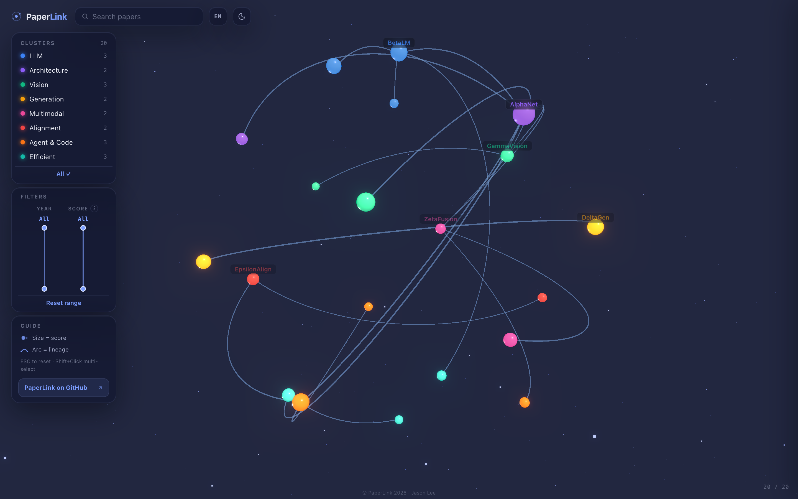
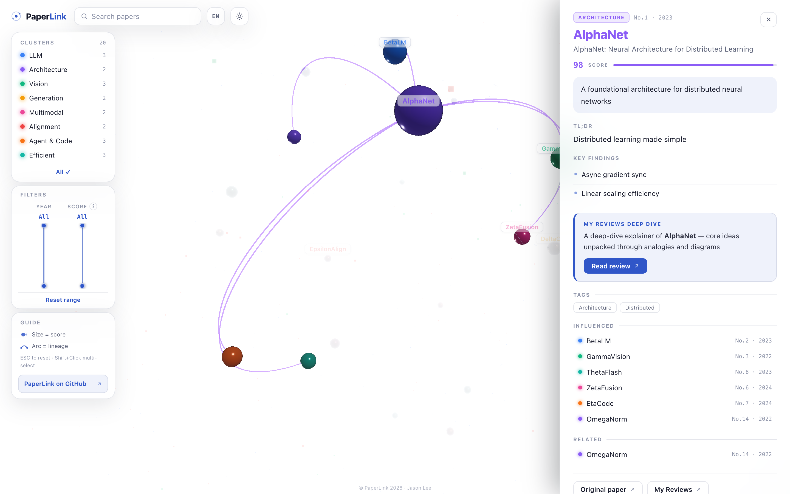

# PaperLink

> Turn any collection of research papers into an interactive 3D galaxy visualization.

<p align="center">
  
  
  
  
</p>

<p align="center">
  <a href="https://jsonpassion.github.io/papergoat-galaxy/">Live Demo (PaperGoat Galaxy)</a> ·
  <a href="https://jsonpassion.github.io/papergoat-apple/">Live Demo (Apple ML)</a>
</p>

<table align="center">
  <tr>
    <td></td>
    <td></td>
  </tr>
</table>

---

## Features

- **3D Interactive Globe** — Papers as glowing nodes on a sphere, edges as curved lineage arcs
- **Click & Explore** — Click any node for details, Shift+Click for multi-select
- **Filter & Search** — Filter by category, year, score; full-text search
- **Fully Brandable** — Logo, footer, promo link, and review CTA configured from `papers.json` (`site` block) — no HTML edits needed
- **Dark / Light Mode** — Galaxy theme in dark, atom-lab theme in light; persisted per visitor
- **Bilingual (EN/KR)** — Built-in i18n with one-click toggle
- **Responsive** — Desktop, tablet, and mobile optimized
- **Deep Links** — `?paper=<id>` opens a paper's detail panel directly; `?theme=` and `?lang=` overrides for sharing
- **Single HTML** — No server, no build tools required for basic usage
- **GitHub Pages Ready** — Deploy in 2 minutes

---

## Quick Start

### Option A: Fork & Deploy (2 min)

1. **Fork this repository** — Click the "Fork" button above
2. **Enable GitHub Pages** — Go to Settings > Pages > Source: `main` / `root`
3. **Done!** — Your galaxy is live at `https://<your-username>.github.io/paperlink/`

The template ships with 20 sample papers. Edit `papers.json` to add your own.

### Option B: Local Development

```bash
# Clone
git clone https://github.com/jsonpassion/paperlink.git
cd paperlink

# Copy sample data
cp papers.sample.json papers.json

# Open in browser (any local server works)
python -m http.server 8000
# → http://localhost:8000
```

---

## Customizing Your Data

### Step 1: Brand it — the `site` block

All branding lives in `papers.json` under `site`. No need to touch `index.html`:

```json
{
  "site": {
    "name": "PaperLink",
    "logo": ["Paper", "Link"],
    "tagline": "Research Paper Galaxy",
    "link": { "label": "PaperLink on GitHub", "url": "https://github.com/you/your-repo" },
    "footer": "© PaperLink 2026",
    "footerLinks": [{ "label": "Your Name", "url": "https://..." }],
    "cta": { "brand": "My Reviews", "url": "https://your-newsletter.com" }
  }
}
```

| Field | What it does |
|-------|--------------|
| `name` / `tagline` | Browser tab title (`name — tagline`) |
| `logo` | Header wordmark: `["Paper", "Link"]` → second part gets the accent color |
| `link` | Promo link shown in the Guide card (omit to hide) |
| `footer` / `footerLinks` | Bottom-center credit line |
| `cta` | Review call-to-action card in the detail panel (omit to hide entirely) |

Every field is optional — sensible defaults apply.

### Step 2: Edit `papers.json`

Each paper needs these fields:

```json
{
  "id": "unique-id",
  "rank": 1,
  "alias": "Short Name",
  "title": "Full Paper Title",
  "url": "https://arxiv.org/abs/...",
  "year": 2024,
  "score": 95,
  "categories": ["LLM", "Scaling"],
  "cluster": "llm",
  "reason": "Why this paper matters (shown in detail panel)",
  "reason_en": "English version of reason",
  "one_liner": "한줄 요약 (optional)",
  "one_liner_en": "One-line TL;DR (optional)",
  "key_discoveries": ["핵심 발견 1", "핵심 발견 2"],
  "key_discoveries_en": ["Key finding 1", "Key finding 2"],
  "has_review": false,
  "review_url": ""
}
```

Korean/English pairs (`reason`/`reason_en`, `one_liner`/`one_liner_en`, `key_discoveries`/`key_discoveries_en`) power the built-in language toggle — if one language is missing, the other is used as a fallback.

### Step 3: Define Edges (Paper Lineage)

Edges show relationships between papers:

```json
{
  "edges": [
    {"source": "paper-A", "target": "paper-B", "type": "lineage"}
  ]
}
```

### Step 4: Customize Clusters

Clusters define the color-coded categories. Customize them in the `clusters` section:

```json
{
  "clusters": {
    "llm":        {"label": "LLM",        "color": "#3b82f6"},
    "vision":     {"label": "Vision",     "color": "#10b981"},
    "generation": {"label": "Generation", "color": "#f59e0b"}
  }
}
```

### Step 5: Build for Production (Optional)

To inline data into a single HTML file for deployment:

```bash
python build.py
# → dist/index.html (single file, no external data fetch)
```

Options:
```bash
python build.py --input my_custom_data.json
python build.py --output build/index.html
```

---

## Scoring Rubric

Papers are sized proportionally to their `score` (80–100 range). The default scoring criteria:

| Weight | Criterion | Description |
|--------|-----------|-------------|
| 30% | Paradigm Shift | Did it open a new research direction? |
| 25% | Adoption & Industry | Real-world production usage |
| 20% | Citation & Ecosystem | Downstream research impact |
| 15% | Technical Novelty | Originality and depth |
| 10% | Timeliness | Current relevance and trajectory |

---

## Project Structure

```
paperlink/
├── index.html              ← Visualization engine (Three.js)
├── papers.json             ← Your paper data (gitignored in production)
├── papers.sample.json      ← Sample data with 20 mock papers
├── build.py                ← Inline papers.json into HTML for deployment
├── dist/
│   └── index.html          ← Production build (after running build.py)
├── LICENSE                 ← MIT
└── README.md
```

---

## Keyboard Shortcuts

| Key | Action |
|-----|--------|
| `ESC` | Reset selection & filters |
| `Shift + Click` | Multi-select nodes |
| `Scroll` | Zoom in/out |
| `Drag` | Rotate globe |

## URL Parameters

| Param | Example | Effect |
|-------|---------|--------|
| `paper` | `?paper=1706.03762` | Opens that paper's detail panel on load |
| `theme` | `?theme=light` | Forces light/dark theme |
| `lang` | `?lang=en` | Forces language (`ko`/`en`) |

---

## Live Examples

These sites are built with the same engine:

- **[PaperGoat Galaxy](https://jsonpassion.github.io/papergoat-galaxy/)** — Top 151 AI papers, curated & ranked
- **[PaperGoat Apple](https://jsonpassion.github.io/papergoat-apple/)** — Top 100 Apple ML research papers

---

## Contributing

PRs are welcome — bug fixes, new features, UX improvements. Please open an issue first for large changes.

---

## License

MIT License. See [LICENSE](LICENSE) for details.

Built by [Jason Lee](https://www.linkedin.com/in/json-lee) as part of the [PaperGoat](https://papergoat.beehiiv.com/) project.

If you find this useful, a star would be appreciated!
